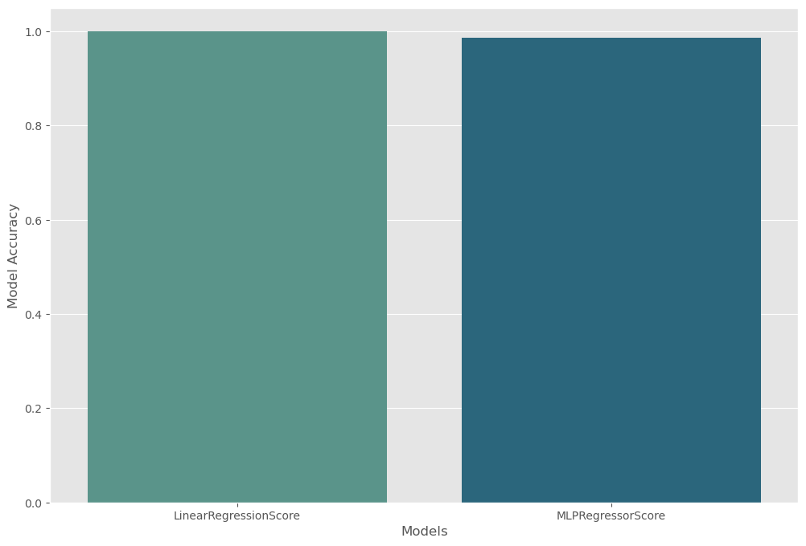

# Applicant Project Score Prediction

## Project Overview

This project aims to develop a model for predicting the project scores of applicants in a company's recruitment process. Applicants undergo a test covering various technical subjects and complete a project related to their field of employment. The goal is to estimate the project score based on test scores and other relevant information.

### Problem Statement

The challenge involves creating a predictive model that accurately estimates an applicant's project score using their test results and other variables. The project focuses on exploring different machine learning algorithms, including MLP (Multi-Layer Perceptron) and regression techniques, for this purpose.

### Desired Outcomes

The project involves several key steps:

1. **Data Analysis and Pre-processing:** Initial exploration and preparation of the data for modeling.
2. **Model Development:** Using MLP and regression algorithms to develop the predictive model.
3. **Model Evaluation and Optimization:** Each step in the data analysis and model development is explained, including the rationale behind the chosen methods.
4. **Detailed Documentation:** A PDF file containing a detailed report of the analysis, model development, and findings.

## Repository Structure

- `HW2-1-v2.ipynb`: Jupyter notebook containing the entire analysis and model development process.
- `Q1.csv`: The dataset used for the analysis.
- `Report.pdf`: A PDF file containing a detailed report of the analysis and findings.

## Key Results

- The comparison between LinearRegressionScore and MLPRegressorScore in terms of accuracy is depicted in the notebook.

  
  
- Insights on the best parameters and structure for MLP and other machine learning algorithms that yield the desired results are discussed.

## How to Use

- Clone the repository.
- Ensure you have Jupyter Notebook installed.
- Run `HW2-1-v2.ipynb` to view the analysis and results.
